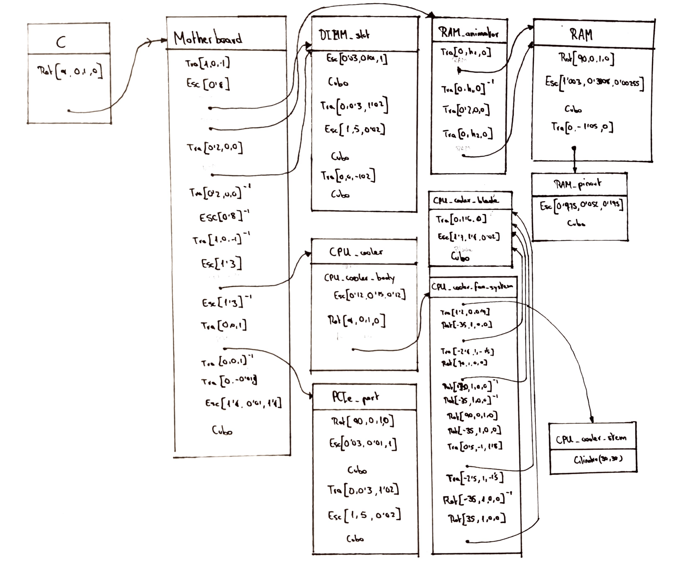

# Documentación de la práctica 3

> Autor: Andrés Millán

En esta sección veremos el grafo tipo PHIGS que se ha realizado, así como los parámetros usados para la animación.



Parámetros en el código:

```
class C: public NodoGrafoEscena {
protected:
    Matriz4f * traslacion_RAM1 = nullptr;
    Matriz4f * traslacion_RAM2 = nullptr;
    Matriz4f * CPU_fan_rotator = nullptr;
    Matriz4f * mobo_rotator    = nullptr;
...
}
```
1. `traslacion_RAM1`: controla la subida y bajada del primer módulo de RAM.
2. `traslacion_RAM2`: controla la subida y bajada del segundo módulo de RAM.
3. `CPU_fan_rotator`: controla la rotación de los ventiladores de la CPU.
4. `mobo_rotator`: controla la rotación de la placa base.

Se tienen 4 grados de libertad.